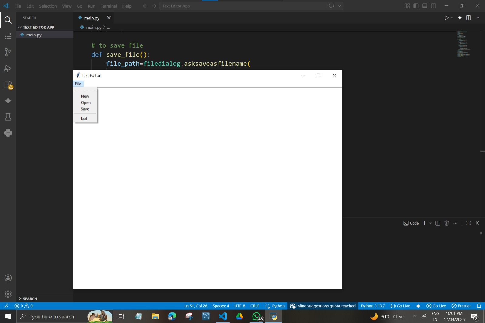
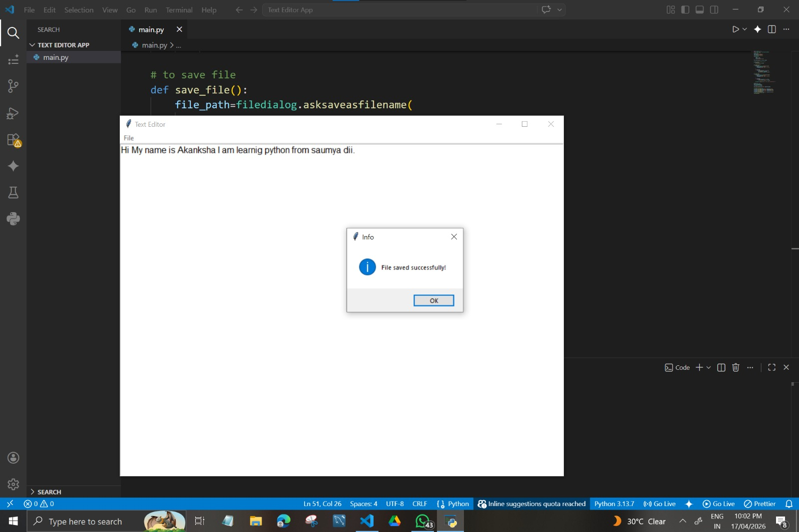

# Text Editor Application (Python)

A simple Notepad-like desktop application built using Python Tkinter.

## Features
- Create new file
- Open existing file
- Edit text
- Save file
- User-friendly GUI

## Technologies Used
- Python
- Tkinter

## How to Run
1. Install Python
2. Run the file:
   python app.py

## Screenshots

### Main Interface

### File Open / Editing

## Author
Akanksha Kumari
